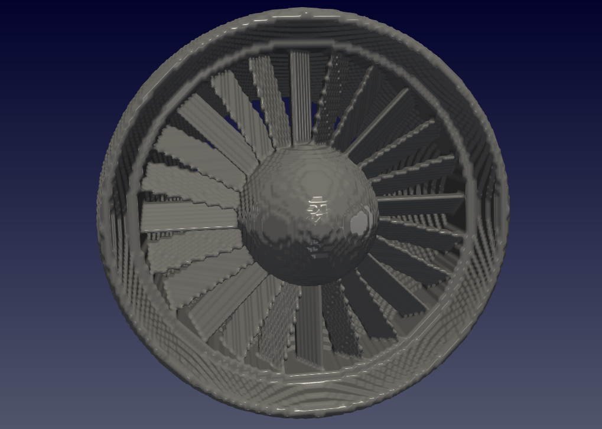
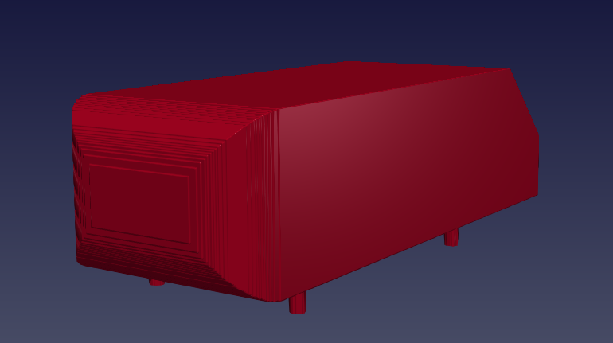

.. _exemplos:

Examples
*********
Para que seja possível rodar os exemplos demonstrados na página,
**copie as linhas de código e cole nos locais indicados no** ``Notebook``.

O usuário encontrará células comentadas com a indicação de onde colar. Essa
indicação representa o capítulo do ``Notebook``, como demonstra a figura:

.. image:: images/ex_coleaqui.png
   :align: center

Caso queira apenas obter os arquivos necessários para visualização no
ParaView (arquivo .xdmf lido com a opção XMDF Reader) e simulação numérica através
do ``incompact3d`` (arquivos Epsi), **faça o download disponível**.

1. Cybertruck
====================

.. figure:: images/cyber.jpg
   :align: center

   *Polemic american car 3D's version rebuilt in Epsi Matrix;*

Demanda do Dr. FS: :download:`projeto Cyber em apenas 2D <downloads/cyber_2d.zip>`.

Faça o :download:`download dos arquivos  <downloads/cyber.zip>` ou
**copie e cole onde é explicitado no** ``Notebook``:

   **1.1. Domain** ::

        lx,ly,lz=8,2,2
        n=45
        nx,ny,nz=lx*n,ly*n,lz*n

   **1.3.1. Control Points' Generation** ::

        c.eq_storage={}
        c.list_storage = {}

        set_point_matrix(2,2) #from set_point_matrix to gen_bezier: creating a surface
        point_storage['P00']=[1.26,1,0.468]
        point_storage['P01']=[1.26,1,0.789]
        point_storage['P10']=[3.1,0.763,0.3]
        point_storage['P11']=[3.1,0.763,0.789]
        create_point_matrix()
        translate('x',1)
        translate('z',0.211)
        gen_bezier('0','high back')

        set_point_matrix(2,2)
        point_storage['P00']=[3.1,0.763,0.3]
        point_storage['P01']=[3.1,0.763,0.789]
        point_storage['P10']=[3.02,0.263,0.328]
        point_storage['P11']=[3.02,0.263,0.789]
        create_point_matrix()
        translate('x',1)
        translate('z',0.211)
        gen_bezier('1','med back')

        set_point_matrix(2,2)
        point_storage['P00']=[3.02,0.263,0.328]
        point_storage['P01']=[3.02,0.263,0.789]
        point_storage['P10']=[2.76,0.187,0.328]
        point_storage['P11']=[2.76,0.187,0.789]
        create_point_matrix()
        translate('x',1)
        translate('z',0.211)
        gen_bezier('2','low back')

        set_point_matrix(2,2)
        point_storage['P00']=[2.76,0.187,0.328]
        point_storage['P01']=[2.76,0.187,0.789]
        point_storage['P10']=[0.131,0.187,0.328]
        point_storage['P11']=[0.131,0.187,0.789]
        create_point_matrix()
        translate('x',1)
        translate('z',0.211)
        gen_bezier('3','under')

        set_point_matrix(2,2)
        point_storage['P00']=[1.26,1,0.468]
        point_storage['P01']=[1.26,1,0.789]
        point_storage['P10']=[0.105,0.631,0.3]
        point_storage['P11']=[0.105,0.631,0.789]
        create_point_matrix()
        translate('x',1)
        translate('z',0.211)
        gen_bezier('4','high front')

        set_point_matrix(2,2)
        point_storage['P00']=[0.105,0.631,0.3]
        point_storage['P01']=[0.105,0.631,0.457]
        point_storage['P10']=[0,0.578,0.457]
        point_storage['P11']=[0,0.578,0.457]
        create_point_matrix()
        translate('x',1)
        translate('z',0.211)
        gen_bezier('5','high right triang')

        set_point_matrix(2,2)
        point_storage['P00']=[0.105,0.631,0.457]
        point_storage['P01']=[0,0.578,0.457]
        point_storage['P10']=[0.105,0.631,0.789]
        point_storage['P11']=[0,0.578,0.789]
        create_point_matrix()
        translate('x',1)
        translate('z',0.211)
        gen_bezier('6','front square')

        set_point_matrix(2,2)
        point_storage['P00']=[0.131,0.187,0.328]
        point_storage['P01']=[0.131,0.187,0.434]
        point_storage['P10']=[0.065,0.263,0.434]
        point_storage['P11']=[0.065,0.263,0.434]
        create_point_matrix()
        translate('x',1)
        translate('z',0.211)
        gen_bezier('7','low right triang')

        set_point_matrix(2,2)
        point_storage['P00']=[0.065,0.263,0.434]
        point_storage['P01']=[0.131,0.187,0.434]
        point_storage['P10']=[0.065,0.263,0.789]
        point_storage['P11']=[0.131,0.187,0.789]
        create_point_matrix()
        translate('x',1)
        translate('z',0.211)
        gen_bezier('8','front square 2')

        set_point_matrix(2,2)
        point_storage['P00']=[0.105,0.631,0.3]
        point_storage['P01']=[0,0.578,0.457]
        point_storage['P10']=[0.131,0.187,0.328]
        point_storage['P11']=[0.065,0.263,0.434]
        create_point_matrix()
        translate('x',1)
        translate('z',0.211)
        gen_bezier('9','right front')

        set_point_matrix(2,2)
        point_storage['P00']=[0,0.578,0.457]
        point_storage['P01']=[0,0.578,0.789]
        point_storage['P10']=[0.065,0.263,0.434]
        point_storage['P11']=[0.065,0.263,0.789]
        create_point_matrix()
        translate('x',1)
        translate('z',0.211)
        gen_bezier('10','mid front')

        set_point_matrix(2,2)
        point_storage['P00']=[1.26,1,0.468]
        point_storage['P01']=[0.105,0.631,0.3]
        point_storage['P10']=[3.1,0.763,0.3]
        point_storage['P11']=[3.1,0.763,0.3]
        create_point_matrix()
        translate('x',1)
        translate('z',0.211)
        gen_bezier('11','high lat')

        set_point_matrix(2,2)
        point_storage['P00']=[0.131,0.187,0.328]
        point_storage['P01']=[0.105,0.631,0.3]
        point_storage['P10']=[3.02,0.263,0.328]
        point_storage['P11']=[3.1,0.763,0.3]
        create_point_matrix()
        translate('x',1)
        translate('z',0.211)
        gen_bezier('12','low lat')

        set_point_matrix(2,2)
        point_storage['P00']=[0.131,0.187,0.328]
        point_storage['P01']=[0.131,0.187,0.328]
        point_storage['P10']=[3.02,0.263,0.328]
        point_storage['P11']=[2.76,0.187,0.328]
        create_point_matrix()
        translate('z',0.211)
        translate('x',1)
        gen_bezier('13','under lat')

        gen_cylinder('14','back w','xy',0.263,2.53+1,0.263,0.328+0.211,0.539+0.211)

        gen_cylinder('15','front w','xy',0.263,0.465+1,0.263,0.328+0.211,0.539+0.211)

   **1.3.3. Epsi's Generation** ::

        c.epsi_3d=np.zeros((c.nx,c.ny,c.nz),dtype=np.float32)

        gen_epsi_cylinder('14','solid',cyl_raf_path=False)
        gen_epsi_cylinder('15','solid',cyl_raf_path=False)

        gen_epsi_bezier('entry+exit and/or entry','zy','4',bez_raf_path=False,solver='sympy')
        gen_epsi_bezier('entry+exit and/or entry','zy','5',bez_raf_path=False,solver='sympy')
        gen_epsi_bezier('entry+exit and/or entry','zy','6',bez_raf_path=False,solver='sympy')
        gen_epsi_bezier('entry+exit and/or entry','zy','7',bez_raf_path=False,solver='sympy')
        gen_epsi_bezier('entry+exit and/or entry','zy','8',bez_raf_path=False,solver='sympy')
        gen_epsi_bezier('entry+exit and/or entry','zy','9',bez_raf_path=False,solver='sympy')
        gen_epsi_bezier('entry+exit and/or entry','zy','10',bez_raf_path=False,solver='sympy')
        gen_epsi_bezier('entry+exit and/or exit','zy','11',bez_raf_path=False,solver='sympy')
        gen_epsi_bezier('entry+exit and/or exit','zy','12',bez_raf_path=False,solver='sympy')
        gen_epsi_bezier('entry+exit and/or exit','zy','0',bez_raf_path=False,solver='sympy')
        gen_epsi_bezier('entry+exit and/or exit','zy','1',bez_raf_path=False,solver='sympy')
        gen_epsi_bezier('entry+exit and/or exit','zy','2',bez_raf_path=False,solver='sympy')

        bounds_into_single_solid(['0','1','2','4','5','6','7','8','9','10','11','12','14','15']
                                 ,'2', solid_raf_path=False)

        gen_epsi_mirror('2','z',mirror_raf_path=False)

2. Esfinge (not updated)
========================

.. figure:: images/esfinge.jpg
   :align: center

   *Versão 3D do monumento egípcio recriada em Epsi;*

Faça o :download:`download dos arquivos  <downloads/sphinx.zip>` ou
**copie e cole onde é explicitado no** ``Notebook``:

   **1.1. Domain** ::

        lx,ly,lz=74,21.5,20
        nx,ny,nz=int(74*1),int(21.5*1),int(20*1)

   **1.3.1. Control Points' Generation** ::

        c.eq_storage={}
        c.list_storage = {}

        set_point_matrix(3,2)
        point_storage['P00']=[3,0,0]
        point_storage['P01']=[3,0,3.20]
        point_storage['P10']=[4,2.8,0]
        point_storage['P11']=[4,2.8,3.20]
        point_storage['P20']=[5,3.20,0]
        point_storage['P21']=[5,3.20,3.20]
        create_point_matrix(True)
        translate('z',0.5)
        gen_bezier('0','front paw entry')

        set_point_matrix(2,2)
        point_storage['P00']=[21.6,0,0]
        point_storage['P01']=[25.6,0,3.20]
        point_storage['P10']=[21.6,3.20,0]
        point_storage['P11']=[30.6,3.20,3.20]
        create_point_matrix()
        translate('z',0.5)
        gen_bezier('1','elbow, exit')

        set_point_matrix(2,2)
        point_storage['P00']=[21.6,0,3.20]
        point_storage['P01']=[21.6,0,9.5]
        point_storage['P10']=[21.6,3.20,3.20]
        point_storage['P11']=[21.6,3.20,9.5]
        create_point_matrix()
        translate('z',0.5)
        gen_bezier('2','chest, entry')

        set_point_matrix(2,2)
        point_storage['P00']=[21.6,3.2,0]
        point_storage['P01']=[21.6,3.2,9.5]
        point_storage['P10']=[25.6,8.4,3.2]
        point_storage['P11']=[25.6,8.4,9.5]
        create_point_matrix()
        translate('z',0.5)
        gen_bezier('3','chest_2, entry')

        set_point_matrix(2,2)
        point_storage['P00']=[21.6,3.2,0]
        point_storage['P01']=[30.6,3.2,3.20]
        point_storage['P10']=[25.6,8.4,3.2]
        point_storage['P11']=[30.6,8.4,3.2]
        create_point_matrix()
        translate('z',0.5)
        gen_bezier('4','front paw, exit')

        set_point_matrix(2,2)
        point_storage['P00']=[22.5,12,9.5]
        point_storage['P01']=[22.5,12,7]
        point_storage['P10']=[23.5,19,9.5]
        point_storage['P11']=[23.5,19,7]
        create_point_matrix(deflection=True)
        translate('z',0.5)
        gen_bezier('5','face, entry', True)

        set_point_matrix(2,3)
        point_storage['P00']=[25.6,8.4,9.5]
        point_storage['P01']=[26.6,8.4,7]
        point_storage['P02']=[27.6,8.4,6]
        point_storage['P10']=[24.6,12,9.5]
        point_storage['P11']=[25.6,12,7]
        point_storage['P12']=[27.6,12,6]
        create_point_matrix(deflection=True)
        translate('z',0.5)
        gen_bezier('6','neck, entry')

        set_point_matrix(2,2)
        point_storage['P00']=[27.6,12,1]
        point_storage['P01']=[27.6,12,7]
        point_storage['P10']=[27.6,20.5,5.5]
        point_storage['P11']=[27.6,20.5,7]
        create_point_matrix(deflection=True)
        translate('z',0.5)
        gen_bezier('7','back neck,entry')

        set_point_matrix(3,2)
        point_storage['P00']=[27.6,12,1]
        point_storage['P01']=[27.6,20.5,5.5]
        point_storage['P10']=[34,12,5.5]
        point_storage['P11']=[30,20.5,5.5]
        point_storage['P20']=[35,12,9.5]
        point_storage['P21']=[31,20.5,9.5]
        create_point_matrix(deflection=True)
        translate('z',0.5)
        gen_bezier('8','back neck 2, exit')

        set_point_matrix(2,2)
        point_storage['P00']=[27.6,8.4,3.5]
        point_storage['P01']=[27.6,8.4,6]
        point_storage['P10']=[27.6,12,1]
        point_storage['P11']=[27.6,12,6]
        create_point_matrix(deflection=True)
        translate('z',0.5)
        gen_bezier('9','front neck, entry')

        set_point_matrix(2,2)
        point_storage['P00']=[27.6,8.4,3.2]
        point_storage['P01']=[27.6,8.4,9.5]
        point_storage['P10']=[65,8.4,3.2]
        point_storage['P11']=[65,8.4,9.5]
        create_point_matrix()
        translate('z',0.5)
        gen_bezier('10','back')

        set_point_matrix(2,2)
        point_storage['P00']=[65,8.4,3.2]
        point_storage['P01']=[65,8.4,9.5]
        point_storage['P10']=[70,3.2,0]
        point_storage['P11']=[70,3.2,9.5]
        create_point_matrix()
        translate('z',0.5)
        gen_bezier('11','breech, exit')

        set_point_matrix(2,2)
        point_storage['P00']=[70,3.2,0]
        point_storage['P01']=[70,3.2,9.5]
        point_storage['P10']=[70,0,0]
        point_storage['P11']=[70,0,9.5]
        create_point_matrix()
        translate('z',0.5)
        gen_bezier('12','breech 2, exit')

        set_point_matrix(3,2)
        point_storage['P00']=[53,0,0]
        point_storage['P01']=[53,0,3.20]
        point_storage['P10']=[54,2.8,0]
        point_storage['P11']=[54,2.8,3.20]
        point_storage['P20']=[55,3.20,0]
        point_storage['P21']=[55,3.20,3.20]
        create_point_matrix(True)
        translate('z',0.5)
        gen_bezier('13','back paw, entry')

        set_point_matrix(2,2)
        point_storage['P00']=[60,3.2,0]
        point_storage['P01']=[60,3.2,3.20]
        point_storage['P10']=[65,8.4,3.2]
        point_storage['P11']=[65,8.4,3.20]
        create_point_matrix()
        translate('z',0.5)
        gen_bezier('14','knee, entry')

        set_point_matrix(3,2)
        point_storage['P00']=[27.6,12,1]
        point_storage['P01']=[27.6,8.4,3.5]
        point_storage['P10']=[34,12,5.5]
        point_storage['P11']=[33,8.4,5.5]
        point_storage['P20']=[35,12,9.5]
        point_storage['P21']=[34,8.4,9.5]
        create_point_matrix(deflection=True)
        translate('z',0.5)
        gen_bezier('15','back neck 3, exit')

        set_point_matrix(2,2)
        point_storage['P00']=[23.5,19,9.5]
        point_storage['P01']=[23.5,19,7]
        point_storage['P10']=[26,20.5,9.5]
        point_storage['P11']=[26,20.5,7]
        create_point_matrix(deflection=True)
        translate('z',0.5)
        gen_bezier('16','side face, entry')

        set_point_matrix(2,2)
        point_storage['P00']=[22.5,12,7]
        point_storage['P01']=[25,12,5.5]
        point_storage['P10']=[23.5,19,7]
        point_storage['P11']=[25,19,5.5]
        create_point_matrix(deflection=True)
        translate('z',0.5)
        gen_bezier('17','side face 2, entry')

        set_point_matrix(2,2)
        point_storage['P00']=[23.5,19,7]
        point_storage['P01']=[25,19,5.5]
        point_storage['P10']=[26,20.5,7]
        point_storage['P11']=[26,20.5,7]
        create_point_matrix(deflection=True)
        translate('z',0.5)
        gen_bezier('18','side face 3, entry')

        set_point_matrix(2,2)
        point_storage['P00']=[22.5,12,9.5]
        point_storage['P01']=[22.5,12,8.5]
        point_storage['P10']=[22.5,8,9.5]
        point_storage['P11']=[22.5,8,9]
        create_point_matrix(deflection=True)
        translate('z',0.5)
        gen_bezier('19','beard, entry')

        set_point_matrix(2,2)
        point_storage['P00']=[23.5,12,9.5]
        point_storage['P01']=[23.5,12,8.5]
        point_storage['P10']=[23,8,9.5]
        point_storage['P11']=[23,8,9]
        create_point_matrix(deflection=True)
        translate('z',0.5)
        gen_bezier('20','beard, exit')

   **1.3.3. Epsi's Generation** ::

        c.epsi_3d=np.zeros((c.nx,c.ny,c.nz),dtype=np.float32)
        c.epsi_3d_x_raf=np.zeros((c.nx_raf,c.ny,c.nz),dtype=np.float32)
        c.epsi_3d_y_raf=np.zeros((c.nx,c.ny_raf,c.nz),dtype=np.float32)
        c.epsi_3d_z_raf=np.zeros((c.nx,c.ny,c.nz_raf),dtype=np.float32)

        gen_epsi_bezier('entry+exit and/or entry','zy','19')
        gen_epsi_bezier('entry+exit and/or exit','zy','20')

        gen_epsi_bezier('entry+exit and/or entry','zy','0')
        gen_epsi_bezier('entry+exit and/or entry','zy','2')
        gen_epsi_bezier('entry+exit and/or entry','zy','3')
        gen_epsi_bezier('entry+exit and/or entry','zy','5')
        gen_epsi_bezier('entry+exit and/or entry','zy','6')
        gen_epsi_bezier('entry+exit and/or entry','zy','7')
        gen_epsi_bezier('entry+exit and/or entry','zy','9')
        gen_epsi_bezier('entry+exit and/or entry','zy','16')
        gen_epsi_bezier('entry+exit and/or entry','zy','17')
        gen_epsi_bezier('entry+exit and/or entry','zy','18')

        gen_epsi_bezier('entry+exit and/or exit','zy','1')
        gen_epsi_bezier('entry+exit and/or exit','zy','4')
        gen_epsi_bezier('entry+exit and/or exit','zy','8')
        gen_epsi_bezier('entry+exit and/or exit','zy','15')

        gen_epsi_bezier('entry+exit and/or entry','zy','13')
        gen_epsi_bezier('entry+exit and/or entry','zy','14')
        gen_epsi_bezier('entry+exit and/or exit','zy','11')
        gen_epsi_bezier('entry+exit and/or exit','zy','12')

3. Nozzle
==========================
.. figure:: images/nozzle.png
   :align: center

   *Nozzle criado com a função de revolve e algumas superfície de Bézier;*

4. Casco de Turbina
==========================
.. figure:: images/turbina.png
   :align: center

   *O processo de dimensionamento e geração de epsi dessa turbina foi feita em menos de 5 minutos;*

5. Ventilador de Turbina
==========================

   *Ventilador e casco de turbina criados para testar o código;*

6. Canal Sinuoso
==========================
.. figure:: images/canal_0.png
  :align: center

  *Canal construído com cerca de 150 curvas de Bézier de 2ª ordem;*

7. Trocador Casco e Tubos
==========================
.. figure:: images/troca_2.png
  :align: center

  *Trocador de Calor com tubos e chicanas (sem representação física);*

8. Ahmed Body
==========================

  *O incrivelmente feio Ahmed Body (embora pareça simples, é bem complicado);*
