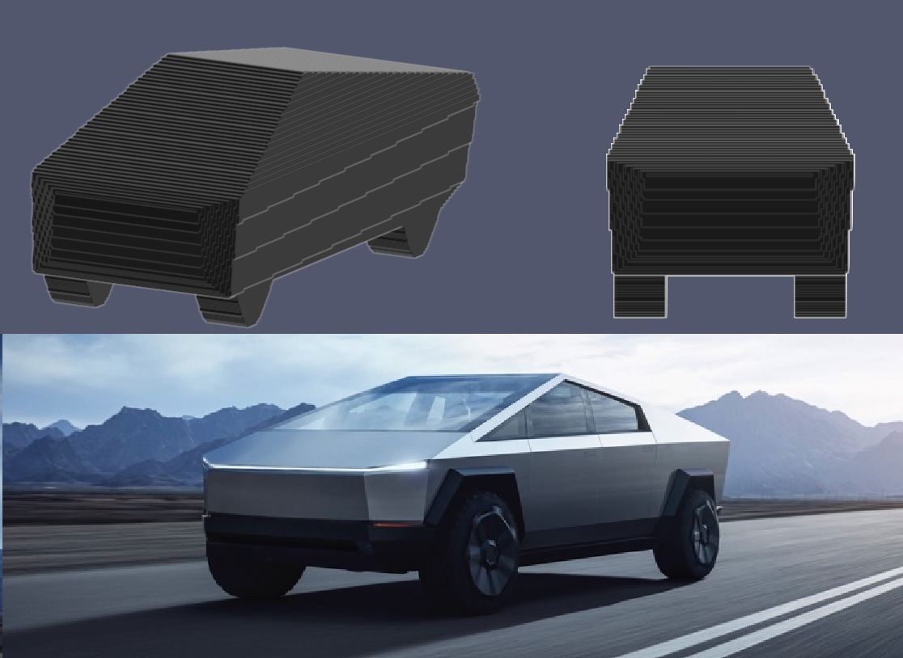
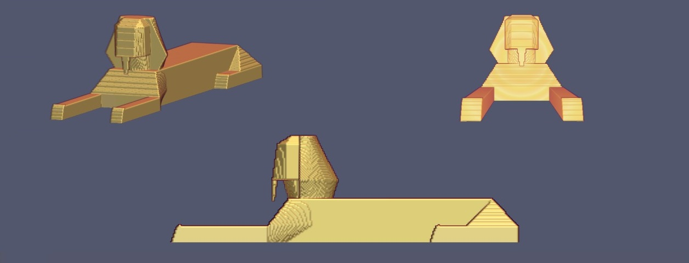
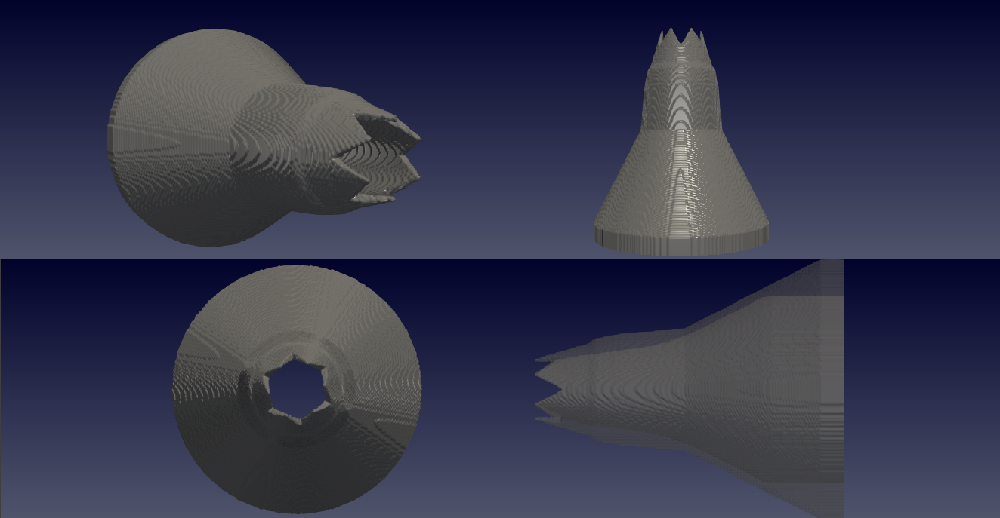
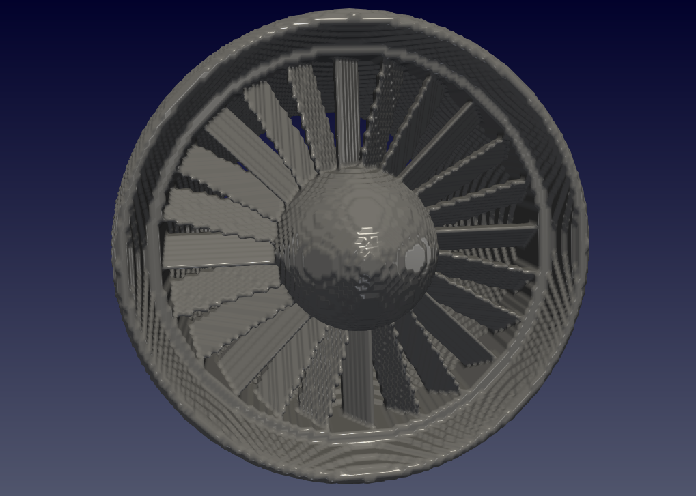
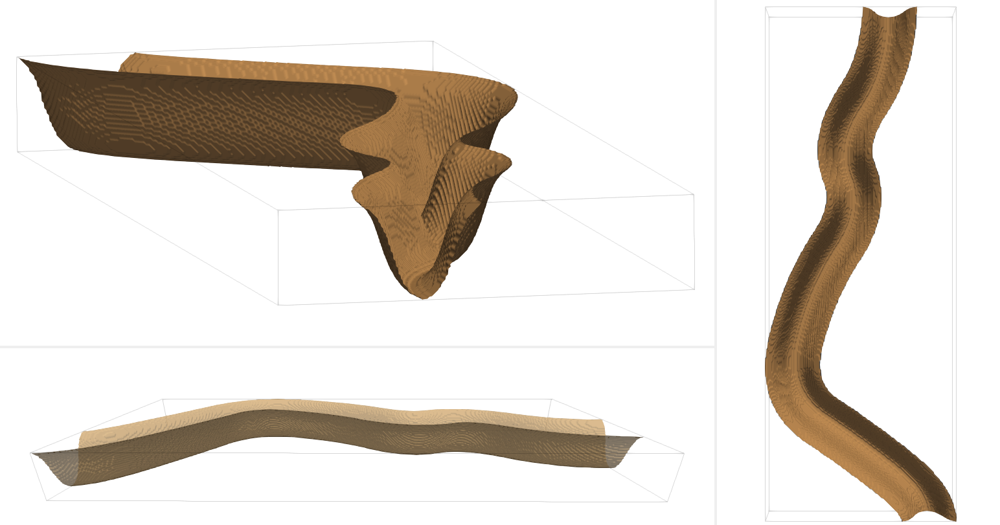
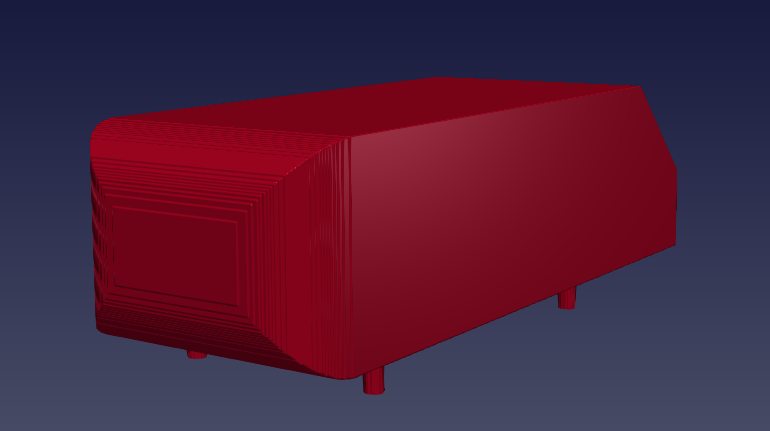

.. _gallery:

Galeria
*********

Confira nessa página imagens de alguns exemplos marcantes já construídos pelo
script.

1. Cybertruck
====================

   *Polemic american car 3D's version rebuilt in Epsi Matrix;*

2. Esfinge
========================

   *Versão 3D do monumento egípcio recriada em Epsi;*

3. Nozzle
==========================

   *Nozzle criado com a função de revolve e algumas superfície de Bézier;*

4. Ventilador de Turbina
==========================

   *Ventilador e casco de turbina criados para testar o código;*

5. Canal Sinuoso
==========================

  *Canal construído com cerca de 150 curvas de Bézier de 2ª ordem;*

6. Trocador Casco e Tubos
==========================
.. figure:: images/troca_2.png
  :align: center

  *Trocador de Calor com tubos e chicanas (sem representação física);*

7. Ahmed Body
==========================

  *O incrivelmente feio Ahmed Body (embora pareça simples, é bem complicado);*
