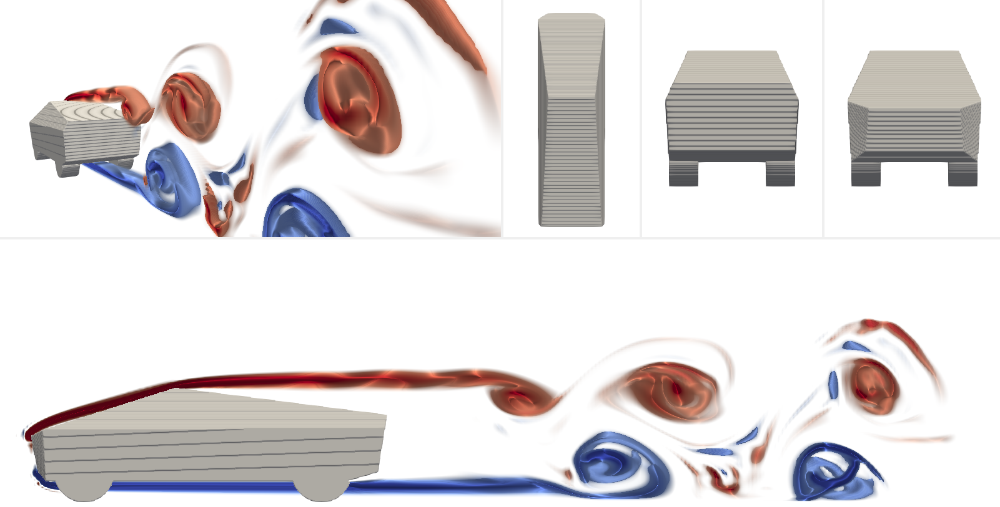

Documentação ``geo_bezier_3d``
=========================================================

Projetado para ser o mais robusto possível, ``geo_bezier_3d`` é capaz de entregar
resultados satisfatórios quando se trata de construção de sólidos para `IBM
<https://www.sciencedirect.com/topics/engineering/immersed-boundary-method>`_
aplicada no código |optparse.incompact3d|_.

.. |optparse.incompact3d| replace:: ``incompact3d``
.. _optparse.incompact3d: https://www.incompact3d.com/

Toda matemática utilizada para criação do conteúdo é descrita pela abordagem
de Bézier. Há bastante material disponível na internet sobre o assunto,
mesmo assim há uma pequena parte *homemade* nesta página dedicada somente às Bézier.
Além disso, neste *doc* o usuário será
capaz de entender como as funções disponíveis no código funcionam e
terá livre acesso aos exemplos já desenvolvidos.

Antes de prosseguir aos conteúdos, deve-se definir alguns termos que são exaustivamente
repetidos ao longo da documentação e talvez não tenham um significado tão evidente:

    **1. Notebook:** interface encontrada na pasta ``/Jupyter Notebook``
    em arquivo ``.ipynb`` em que o usuário pode construir
    sólidos e/ou montar exemplos já construídos.

    **2. Epsi:** matriz binária gerada através do ``geo_bezier_3d`` e
    usada como entrada no ``incompact3d``.

Aproveite a documentação e, na hora de construir um sólido, seja criativo!

.. toctree::
   :maxdepth: 10
   :caption: Conteúdos:

   bezier
   instrucoes
   exemplos
